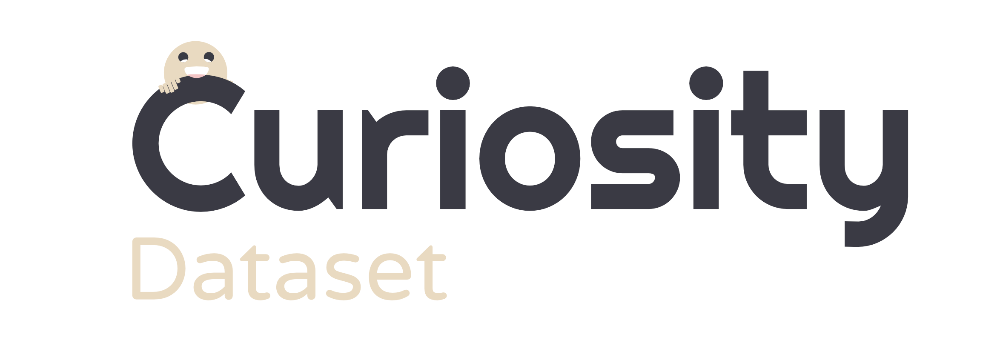

<!-- PROJECT SHIELDS -->


<!-- PROJECT LOGO -->
<br />
<p align="center">
  <a href="https://github.com/Mr-Vicente/Curiosity-Dataset">
    
  </a>

  <h1 align="center">Curiosity Dataset</h1>

  <p align="center">
    Curiosities (fun facts) about the cuisine and DIY theme!
    <br />
    <a href="https://github.com/Mr-Vicente/Curiosity-Dataset"><strong>Explore the docs »</strong></a>
    <br />
    <br />
    <a href="https://github.com/Mr-Vicente/Curiosity-Dataset">View Demo</a>
    ·
    <a href="https://github.com/Mr-Vicente/Curiosity-Dataset/issues">Report Bug</a>
    ·
    <a href="https://github.com/Mr-Vicente/Curiosity-Dataset/issues">Request Feature</a>
  </p>
</p>

## Description

Curiosity Dataset is a Python library which provides fun facts (~1350) about the cuisine and DIY theme.

## Installation

You can clone with git to install Curiosity-Dataset.

```bash
git clone https://github.com/Mr-Vicente/Curiosity-Dataset.git
```

## Usage

```python
import Curiosity_Dataset
from utils import Curiosity_Type

# Get cuisine curiosities
curiosity_dataset_path = 'dataset/recipes_dataset'
curiosity_dataset = Curiosity_Dataset(curiosity_dataset_path, Curiosity_Type.RECIPE)
print("Cuisine Curiosities:", curiosity_dataset.curiosity_phrases)
```

## License
[MIT](https://choosealicense.com/licenses/mit/)